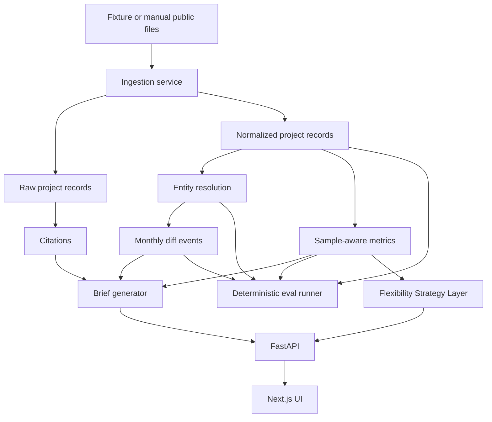

# GridQueue Agent

GridQueue Agent is a local-first public-data intelligence system for interconnection queue monitoring. It ingests
public or synthetic queue snapshots, normalizes messy project records, resolves stable entities across monthly
snapshots, detects meaningful changes, computes sample-aware historical proxy metrics, and generates citation-grounded
Public Interconnection Risk Briefs.

Phase 2 adds a Flexibility Strategy Layer for large-load planning. It evaluates whether a proposed curtailable-load
commitment is worth considering under public FERC/ISO/RTO context and explicit compute-cost assumptions.

It complements power-development platforms such as Paces by focusing on the public-data layer: queue monitoring,
change detection, historical benchmarking, source-grounded summaries, and automated quality checks. It does not copy
parcel-level siting, permitting, proprietary diligence, power-flow studies, or upgrade-cost modeling workflows.

## What it does not do

- It is not a formal interconnection study, deliverability study, power-flow result, or upgrade-cost estimate.
- It does not perform parcel siting, permitting, or proprietary development diligence.
- It does not treat ERCOT generation queue records as a full large-load or data-center queue.
- It does not report rates from samples that are too small; it rolls up or abstains.
- The Flexibility Strategy Layer does not execute curtailment, schedule GPU workloads, submit interconnection filings,
  provide legal advice, estimate real upgrade costs, or guarantee approval.

## Architecture



## Data sources

- ERCOT GIS Report: https://www.ercot.com/mp/data-products/data-product-details?id=pg7-200-er
- ERCOT Large Load Update, April 9 2026: https://www.ercot.com/files/docs/2026/04/09/ERCOTLargeLoadUpdate-April9HouseStateAffairsHearing.pdf
- LBNL Queued Up: https://emp.lbl.gov/queues
- gridstatus queue docs: https://opensource.gridstatus.io/en/latest/interconnection_queues.html

The default demo uses synthetic fixtures under `data/fixtures`. They are clearly marked synthetic and are not market facts.

## Run locally

```powershell
make install
make ingest-fixtures
make test
make eval
make seed-flex-rules
make dev-api
make dev-web
```

Open the API docs at http://127.0.0.1:8000/docs and the web app at http://localhost:3000.
The frontend proxies `/api/backend/*` to `BACKEND_API_URL` and defaults to `http://127.0.0.1:8000`.
If port 8000 is occupied, start the API on another port and run the web app with `BACKEND_API_URL` set to that URL.
If you call the API directly from a different frontend origin, set `GRIDQUEUE_CORS_ORIGINS` to a comma-separated
allowlist.

If `make` is unavailable on Windows, run the underlying commands:

```powershell
python -m pip install -e backend[dev]
cd frontend; npm install; cd ..
python scripts/ingest_fixture.py
python scripts/seed_flexibility_rules.py
python -m pytest backend/tests
python evals/run_evals.py
python -m uvicorn app.main:app --app-dir backend --host 127.0.0.1 --port 8000 --reload
cd frontend; npm run dev
```

## Demo workflow

1. Click `Ingest fixtures` in the UI, or run `make ingest-fixtures`.
2. Use the default ERCOT, Battery, Reeves, 100 MW, 2028 input.
3. Click `Generate brief`.
4. Inspect the Brief, Monthly Diff, Metrics, Entity Matching, Citations, and Evals tabs.

## Phase 2: Flexibility Strategy Layer

Flexibility Strategy Layer is the upstream decision layer to runtime flexibility controllers. It helps evaluate whether
a proposed curtailable-load commitment is worth considering under public rules and explicit compute assumptions. It
does not execute curtailment, schedule GPU workloads, submit interconnection filings, perform formal studies, estimate
real upgrade costs, or guarantee approval.

Seed the rule/evidence database:

```powershell
make seed-flex-rules
```

Windows fallback:

```powershell
python scripts/seed_flexibility_rules.py
```

Generate a flexibility brief through the API:

```powershell
Invoke-RestMethod -Method Post http://127.0.0.1:8000/flexibility/brief -ContentType application/json -Body '{
  "market": "ERCOT",
  "jurisdiction": "FERC",
  "county": "Reeves",
  "peak_mw": 100,
  "average_load_factor": 0.85,
  "commitment_depth_pct": 25,
  "event_duration_hours": 3,
  "events_per_year": 20,
  "dispatchable_or_curtailable": true,
  "metering_or_control_capability": true,
  "min_sample_n": 2
}'
```

New endpoints:

- `GET /flexibility/rules`
- `POST /flexibility/seed`
- `POST /flexibility/compute-cost`
- `POST /flexibility/eligibility`
- `POST /flexibility/tradeoff`
- `POST /flexibility/brief`
- `GET /flexibility/scenarios/{scenario_id}`

UI walkthrough:

1. Ingest fixtures.
2. Seed flexibility rules.
3. Set jurisdiction, peak MW, curtailment commitment, event duration, event count, workload mix, GPU power, penalties,
   and control capability.
4. Click `Generate flex brief`.
5. Inspect the Flexibility Strategy tab for rule statuses, eligibility, compute assumptions, tradeoff table,
   recommendation mode, citations, and caveats.

Rule-status warning: proposed, pending, directed, context-only, technical-evidence, or needs-review records are not
taken as final benefits. If eligibility is ambiguous or the baseline is insufficient, the layer abstains or marks the
result contingent.

See `docs/FLEXIBILITY_STRATEGY.md`, `docs/FLEXIBILITY_RULES.md`, and `docs/COMPUTE_COST_MODEL.md`.

## Entity resolution

The matcher is deterministic and explainable. It scores exact queue IDs, normalized name similarity, interconnecting
entity similarity, county/state, compatible fuel transitions, capacity tolerance, POI similarity, and target COD
proximity. Ambiguous top candidates are flagged and surfaced instead of forced.

See `docs/ENTITY_RESOLUTION.md`.

## Sample-aware rollups

Metrics follow this fallback path: county plus fuel type, county all fuels, market plus fuel type, market all fuels,
LBNL national fallback when available, then abstention. Every rate includes `sample_n`, `fallback_level`, and
confidence.

See `docs/METRICS_AND_ROLLUPS.md`.

## Evals

```powershell
make eval
```

Sample output:

```json
{
  "passed": 26,
  "failed": 0,
  "total": 26
}
```

Reports are generated at `evals/results/latest.json` and `evals/results/latest.md`.

## Manual public-data ingestion

```powershell
python scripts/ingest_live_ercot.py data/raw/<ercot-file.xlsx>
python scripts/ingest_lbnl.py data/raw/<lbnl-file.xlsx>
```

Calling those scripts without a file prints manual-download instructions.

## Tests and quality

- Backend: `python -m pytest backend/tests`
- Evals: `python evals/run_evals.py`
- Frontend typecheck: `cd frontend && npm run typecheck`
- Frontend lint: `cd frontend && npm run lint`
- Frontend build: `cd frontend && npm run build`
- Dependency audit: `cd frontend && npm audit --audit-level=moderate`
- Flexibility seed: `python scripts/seed_flexibility_rules.py`

## Demo screenshots

Screenshots are intentionally not committed. Run `make dev-api` and `make dev-web`, then open the app locally to
inspect the current fixture-backed demo.

## Known limitations

- Automatic ERCOT/LBNL download is not forced in the MVP; manual file ingestion is the supported public-data path.
- Fixture samples are small, so demo metric thresholds are lowered explicitly where needed.
- LBNL national benchmark fallback is represented in methodology but not populated by default fixtures.
- Entity resolution is deterministic and auditable, not a calibrated probabilistic model.
- Flexibility rule seeds require manual verification before real-world use; FERC/PJM pending or directed records are not
  treated as final benefits.
- Compute-cost penalty values are scenario assumptions, not observed market prices or legal/financial advice.

## Roadmap

- Add source-specific ERCOT and LBNL adapters after inspecting current downloaded files.
- Add reviewer workflow for ambiguous entity matches.
- Add market-specific threshold calibration.
- Add optional LLM polishing constrained to deterministic facts and citations.
- Add Docker Compose and hosted preview deployment.
- Add human review workflow for flexibility rule/status verification.
