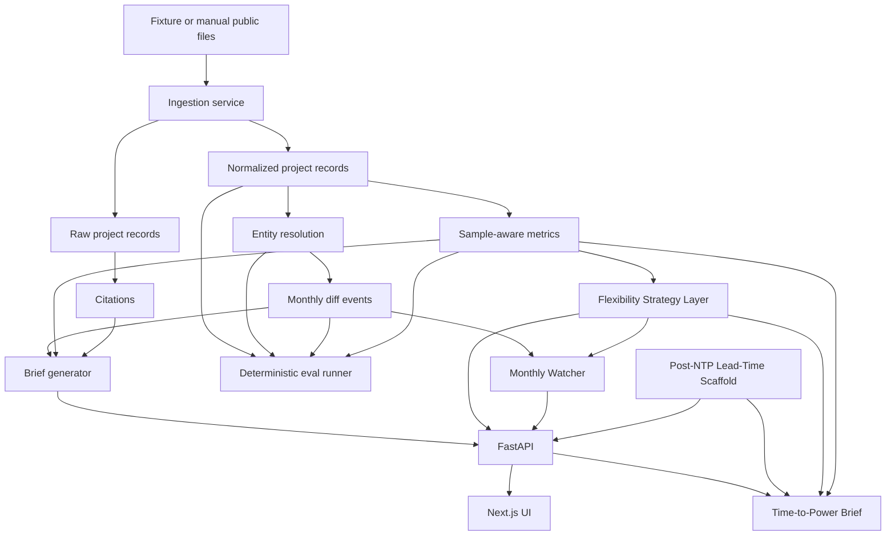

# GridQueue Agent

GridQueue Agent turns public interconnection queue files into source-traceable queue intelligence.

Repository: https://github.com/Kakarottoooo/gridqueue-agent

The basic workflow is simple:

1. Ingest public queue files or deterministic demo fixtures.
2. Normalize messy project names, statuses, fuels, dates, and capacities.
3. Resolve the same project across monthly snapshots.
4. Detect real queue changes: new, withdrawn, completed, delayed, accelerated, capacity changed, or missing.
5. Generate a brief with citations, row counts, file hashes, and reproducibility traces.

The current real-data validation slice uses official ERCOT GIS monthly workbooks and the LBNL Queued Up workbook. The
fastest way to judge the project is to inspect these files:

- `docs/REAL_DATA_VALIDATION.md`
- `reports/real_data/ercot/real_monthly_digest_2026_04_to_2026_05.md`
- `reports/real_data/entity_resolution_audit/ercot_matches_2026_04_to_2026_05.csv`
- `reports/real_data/lbnl/lbnl_reproduction.md`

What this proves today: the parser, normalization, entity matching, diffing, audit, and reporting stack can run against
real public source files and preserve evidence. What it does not prove yet: a complete production SaaS, live ISO
coverage, formal interconnection studies, or large-load/data-center queue coverage.

## Public demo status

This repo now has a deployable public demo shape:

- `render.yaml` defines a FastAPI service and a Next.js web service.
- `scripts/start_public_api.py` seeds deterministic demo data on startup, so visitors can test the UI without running
  local commands.
- The public demo is meant for product discovery and screenshots. The real-data evidence remains in the checked-in
  reports above because raw XLSX source files are intentionally not committed.

Deployment guide: `docs/PUBLIC_DEMO_DEPLOYMENT.md`

## What it does not do

- It is not a formal interconnection study, deliverability study, power-flow result, or upgrade-cost estimate.
- It does not perform parcel siting, permitting, or proprietary development diligence.
- It does not treat ERCOT generation queue records as a full large-load or data-center queue.
- It does not report rates from samples that are too small; it rolls up or abstains.
- The Flexibility Strategy Layer does not execute curtailment, schedule GPU workloads, submit interconnection filings,
  provide legal advice, estimate real upgrade costs, or guarantee approval.
- The Monthly Watcher does not fabricate changes when parsing fails or when entity matching is ambiguous.
- The Post-NTP Lead-Time scaffold is an early knowledge-base demo, not a procurement product.

## Architecture



## Data sources

- ERCOT GIS Report: https://www.ercot.com/mp/data-products/data-product-details?id=pg7-200-er
- ERCOT Large Load Update, April 9 2026: https://www.ercot.com/files/docs/2026/04/09/ERCOTLargeLoadUpdate-April9HouseStateAffairsHearing.pdf
- LBNL Queued Up: https://emp.lbl.gov/queues
- gridstatus queue docs: https://opensource.gridstatus.io/en/latest/interconnection_queues.html
- DOE Large Power Transformer Resilience Report: https://www.energy.gov/sites/default/files/2024-10/EXEC-2022-001242%20-%20Large%20Power%20Transformer%20Resilience%20Report%20signed%20by%20Secretary%20Granholm%20on%207-10-24.pdf

The default demo uses synthetic fixtures under `data/fixtures`. They are clearly marked synthetic and are not market facts.

## Real Data Validation Sprint

Fixture mode proves the software mechanics. Real-data validation proves the parser, normalization, entity-resolution,
diffing, and reporting logic against public source files. The current validated slice is ERCOT GIS month-over-month
diff plus LBNL Queued Up reproduction checks.

Real sources used:

- ERCOT GIS Report, April 2026 and May 2026, from the official ERCOT GIS data product page.
- LBNL Queued Up 2026 Data File, project-level data through end of 2025.

Raw XLSX files are not committed. Place them here if automatic download is unavailable:

```powershell
data/raw/real/ercot/gis/ERCOT_GIS_2026_04.xlsx
data/raw/real/ercot/gis/ERCOT_GIS_2026_05.xlsx
data/raw/real/lbnl/LBNL_Queued_Up_2026_Data_File.xlsx
```

Run the real validation slice:

```powershell
python scripts/download_real_ercot_gis.py
python scripts/run_real_ercot_pair.py --from-file data/raw/real/ercot/gis/ERCOT_GIS_2026_04.xlsx --from-snapshot-date 2026-04-30 --to-file data/raw/real/ercot/gis/ERCOT_GIS_2026_05.xlsx --to-snapshot-date 2026-05-31
python scripts/download_real_lbnl_queued_up.py
python scripts/run_lbnl_reproduction.py --file data/raw/real/lbnl/LBNL_Queued_Up_2026_Data_File.xlsx
python scripts/run_independent_real_checks.py --ercot-from-file data/raw/real/ercot/gis/ERCOT_GIS_2026_04.xlsx --ercot-to-file data/raw/real/ercot/gis/ERCOT_GIS_2026_05.xlsx --lbnl-file data/raw/real/lbnl/LBNL_Queued_Up_2026_Data_File.xlsx
python scripts/generate_real_data_validation_report.py
python evals/run_real_evals.py
```

Outputs:

- `docs/REAL_DATA_VALIDATION.md`
- `reports/real_data/source_manifest.json`
- `reports/real_data/ercot/real_monthly_digest_2026_04_to_2026_05.md`
- `reports/real_data/entity_resolution_audit/ercot_matches_2026_04_to_2026_05.csv`
- `reports/real_data/lbnl/lbnl_reproduction.md`
- `reports/real_data/independent_checks.md`
- `evals/results/real_latest.md`

What passed in the checked-in real slice: real ERCOT workbooks were ingested with file hashes and row counts; a real
April-to-May 2026 diff and digest were generated; an entity-resolution audit was generated; the real LBNL workbook was
profiled and partially reproduced; independent checks passed. What is still manual: human labels for the entity audit.

This does not make the whole platform production-ready. It establishes one real-data validated slice. ERCOT GIS is
generation-resource data, not a complete large-load or data-center queue. LBNL Queued Up is generation/storage
transmission-interconnection data and does not include load interconnection requests, distribution-connected projects,
or behind-the-meter projects.

## Run locally

```powershell
make install
make ingest-fixtures
make test
make eval
make seed-flex-rules
make seed-watch-sources
make run-watcher
make seed-lead-time-kb
make seed-time-to-power-fixtures
make time-to-power-demo
make dev-api
make dev-web
```

Open the API docs at http://127.0.0.1:8000/docs and the web app at http://localhost:3000.
The frontend proxies `/api/backend/*` to `BACKEND_API_URL` and defaults to `http://127.0.0.1:8000`.
If port 8000 is occupied, start the API on another port and run the web app with `BACKEND_API_URL` set to that URL.
If you call the API directly from a different frontend origin, set `GRIDQUEUE_CORS_ORIGINS` to a comma-separated
allowlist.

If `make` is unavailable on Windows, run the underlying commands:

```powershell
python -m pip install -e backend[dev]
cd frontend; npm install; cd ..
python scripts/ingest_fixture.py
python scripts/seed_flexibility_rules.py
python scripts/seed_watch_sources.py
python scripts/run_monthly_watcher.py --mode fixture --period 2026-05
python scripts/seed_lead_time_kb.py
python scripts/seed_time_to_power_fixtures.py
python scripts/run_time_to_power_demo.py
python -m pytest backend/tests
python evals/run_evals.py
python -m uvicorn app.main:app --app-dir backend --host 127.0.0.1 --port 8000 --reload
cd frontend; npm run dev
```

## Demo workflow

1. Click `Ingest fixtures` in the UI, or run `make ingest-fixtures`.
2. Use the default ERCOT, Battery, Reeves, 100 MW, 2028 input.
3. Click `Generate brief`.
4. Inspect the Brief, Monthly Diff, Metrics, Entity Matching, Citations, and Evals tabs.

## Phase 2: Flexibility Strategy Layer

Flexibility Strategy Layer is the upstream decision layer to runtime flexibility controllers. It helps evaluate whether
a proposed curtailable-load commitment is worth considering under public rules and explicit compute assumptions. It
does not execute curtailment, schedule GPU workloads, submit interconnection filings, perform formal studies, estimate
real upgrade costs, or guarantee approval.

Seed the rule/evidence database:

```powershell
make seed-flex-rules
```

Windows fallback:

```powershell
python scripts/seed_flexibility_rules.py
```

Generate a flexibility brief through the API:

```powershell
Invoke-RestMethod -Method Post http://127.0.0.1:8000/flexibility/brief -ContentType application/json -Body '{
  "market": "ERCOT",
  "jurisdiction": "FERC",
  "county": "Reeves",
  "peak_mw": 100,
  "average_load_factor": 0.85,
  "commitment_depth_pct": 25,
  "event_duration_hours": 3,
  "events_per_year": 20,
  "dispatchable_or_curtailable": true,
  "metering_or_control_capability": true,
  "min_sample_n": 2
}'
```

New endpoints:

- `GET /flexibility/rules`
- `POST /flexibility/seed`
- `POST /flexibility/compute-cost`
- `POST /flexibility/eligibility`
- `POST /flexibility/tradeoff`
- `POST /flexibility/brief`
- `GET /flexibility/scenarios/{scenario_id}`

UI walkthrough:

1. Ingest fixtures.
2. Seed flexibility rules.
3. Set jurisdiction, peak MW, curtailment commitment, event duration, event count, workload mix, GPU power, penalties,
   and control capability.
4. Click `Generate flex brief`.
5. Inspect the Flexibility Strategy tab for rule statuses, eligibility, compute assumptions, tradeoff table,
   recommendation mode, citations, and caveats.

Rule-status warning: proposed, pending, directed, context-only, technical-evidence, or needs-review records are not
taken as final benefits. If eligibility is ambiguous or the baseline is insufficient, the layer abstains or marks the
result contingent.

See `docs/FLEXIBILITY_STRATEGY.md`, `docs/FLEXIBILITY_RULES.md`, and `docs/COMPUTE_COST_MODEL.md`.

## Phase 3: Monthly Watcher

The Monthly Regulatory + Queue Change Watcher answers: what materially changed this month in queues and in the public
rules that affect them?

Run it locally:

```powershell
python scripts/run_monthly_watcher.py --mode fixture --period 2026-05
```

New endpoints:

- `GET /watcher/sources`
- `POST /watcher/sources/seed`
- `POST /watcher/run`
- `POST /watcher/queue-adapter`
- `POST /watcher/regulatory-snapshot`
- `POST /watcher/digest`
- `GET /watcher/digests`
- `GET /watcher/digests/latest`
- `GET /watcher/change-events`

The UI has a `Watcher` tab. Fixture mode generates a digest from existing queue diffs, curated source hash changes,
flexibility rule records, suppressed ambiguous matches, parse failures, citations, and reproducibility trace.

See `docs/WATCHER.md`.

## Post-NTP Lead-Time Scaffold

The Post-NTP Lead-Time scaffold is an early knowledge-base demo, not a procurement product. It seeds a cited,
range-based Large Power Transformer lead-time row from a government-report source and exposes it through:

- `POST /procurement/lead-times/seed`
- `GET /procurement/lead-times`

Seed it locally:

```powershell
python scripts/seed_lead_time_kb.py
```

See `docs/POST_NTP_LEAD_TIME.md`.

## Phase 4: Time-to-Power Brief

The Time-to-Power Brief combines:

- GridQueue sample-aware interconnection baseline;
- Flexibility Strategy rule status, eligibility, compute-cost assumptions, and benefit status;
- Post-NTP lead-time critical path;
- commissioning and energization-buffer assumptions.

Run the fixture demo:

```powershell
python scripts/run_time_to_power_demo.py
```

Windows fallback is the same command. The script writes:

- `briefs/time_to_power/latest.md`

API example:

```powershell
Invoke-RestMethod -Method Post http://127.0.0.1:8000/time-to-power/brief -ContentType application/json -Body '{
  "market": "ERCOT",
  "jurisdiction": "FERC",
  "county": "Reeves",
  "project_type": "AI data center load",
  "peak_mw": 300,
  "interconnection_voltage_kv": 345,
  "target_online_year": 2029,
  "commitment_depth_pct": 20,
  "event_duration_hours": 3,
  "events_per_year": 20,
  "procurement_strategy": "post_ntp_serial",
  "min_sample_n": 2
}'
```

Endpoints:

- `GET /time-to-power/health`
- `POST /time-to-power/fixtures/seed`
- `POST /time-to-power/scenarios`
- `GET /time-to-power/scenarios/{scenario_id}`
- `POST /time-to-power/equipment-scope`
- `POST /time-to-power/procurement-critical-path`
- `POST /time-to-power/interconnection-baseline`
- `POST /time-to-power/flex-adjusted`
- `POST /time-to-power/estimate`
- `POST /time-to-power/brief`
- `GET /time-to-power/briefs/latest`
- `GET /time-to-power/briefs/{brief_id}`
- `POST /time-to-power/demo`

UI walkthrough:

1. Ingest fixtures.
2. Seed flexibility rules and lead-time KB if desired, or use `Seed TTP fixtures`.
3. Set project type, peak MW, voltage, jurisdiction, flexibility commitment, procurement strategy, and assumptions.
4. Click `Generate TTP brief`.
5. Inspect the Time to Power tab for baseline metric, flexibility status, procurement critical path, timeline ranges,
   citations, assumptions, caveats, and markdown path.

The required caveat is explicit: the brief is not a formal interconnection study, deliverability study, power-flow
result, legal opinion, engineering design, procurement quote, OEM RFQ, commissioning plan, financial forecast, or
guarantee of energization.

See `docs/TIME_TO_POWER_BRIEF.md`, `docs/PROCUREMENT_CRITICAL_PATH.md`, and `docs/TIME_TO_POWER_MATH.md`.

## Entity resolution

The matcher is deterministic and explainable. It scores exact queue IDs, normalized name similarity, interconnecting
entity similarity, county/state, compatible fuel transitions, capacity tolerance, POI similarity, and target COD
proximity. Ambiguous top candidates are flagged and surfaced instead of forced.

See `docs/ENTITY_RESOLUTION.md`.

## Sample-aware rollups

Metrics follow this fallback path: county plus fuel type, county all fuels, market plus fuel type, market all fuels,
LBNL national fallback when available, then abstention. Every rate includes `sample_n`, `fallback_level`, and
confidence.

See `docs/METRICS_AND_ROLLUPS.md`.

## Evals

```powershell
make eval
```

Sample output:

```json
{
  "passed": 66,
  "failed": 0,
  "total": 66
}
```

Reports are generated at `evals/results/latest.json` and `evals/results/latest.md`.

## Manual public-data ingestion

```powershell
python scripts/ingest_live_ercot.py data/raw/<ercot-file.xlsx>
python scripts/ingest_lbnl.py data/raw/<lbnl-file.xlsx>
```

Calling those scripts without a file prints manual-download instructions.

## Tests and quality

- Backend: `python -m pytest backend/tests`
- Evals: `python evals/run_evals.py`
- Frontend typecheck: `cd frontend && npm run typecheck`
- Frontend lint: `cd frontend && npm run lint`
- Frontend build: `cd frontend && npm run build`
- Dependency audit: `cd frontend && npm audit --audit-level=moderate`
- Flexibility seed: `python scripts/seed_flexibility_rules.py`
- Watcher source seed: `python scripts/seed_watch_sources.py`
- Watcher digest: `python scripts/run_monthly_watcher.py --mode fixture --period 2026-05`
- Lead-time KB seed: `python scripts/seed_lead_time_kb.py`
- Time-to-Power fixture seed: `python scripts/seed_time_to_power_fixtures.py`
- Time-to-Power demo: `python scripts/run_time_to_power_demo.py`
- Real ERCOT profile: `python scripts/profile_real_ercot_gis.py`
- Real ERCOT pair: `python scripts/run_real_ercot_pair.py --from-file data/raw/real/ercot/gis/ERCOT_GIS_2026_04.xlsx --from-snapshot-date 2026-04-30 --to-file data/raw/real/ercot/gis/ERCOT_GIS_2026_05.xlsx --to-snapshot-date 2026-05-31`
- Real LBNL profile: `python scripts/profile_real_lbnl_workbook.py --file data/raw/real/lbnl/LBNL_Queued_Up_2026_Data_File.xlsx`
- Real LBNL reproduction: `python scripts/run_lbnl_reproduction.py --file data/raw/real/lbnl/LBNL_Queued_Up_2026_Data_File.xlsx`
- Real evals: `python evals/run_real_evals.py`

## Demo screenshots

Screenshots are intentionally not committed. Run `make dev-api` and `make dev-web`, then open the app locally to
inspect the current fixture-backed demo.

## Known limitations

- Automatic ERCOT/LBNL download is not forced in the MVP; manual file ingestion is the supported public-data path.
- Fixture samples are small, so demo metric thresholds are lowered explicitly where needed.
- LBNL national benchmark fallback is represented in methodology but not populated by default fixtures.
- Entity resolution is deterministic and auditable, not a calibrated probabilistic model.
- Flexibility rule seeds require manual verification before real-world use; FERC/PJM pending or directed records are not
  treated as final benefits.
- Compute-cost penalty values are scenario assumptions, not observed market prices or legal/financial advice.
- Watcher live mode is conservative and local-first; fixture mode is the default verification path.
- Lead-time data is public-source range data and can become stale; it is not a quote or supplier commitment.
- Time-to-Power is a public-data planning artifact; it is not a formal study, engineering design, procurement quote,
  commissioning plan, financial forecast, or guarantee of energization.

## Roadmap

- Add source-specific ERCOT and LBNL adapters after inspecting current downloaded files.
- Add reviewer workflow for ambiguous entity matches.
- Add market-specific threshold calibration.
- Add optional LLM polishing constrained to deterministic facts and citations.
- Add Docker Compose and hosted preview deployment.
- Add human review workflow for flexibility rule/status verification.
- Add reviewed production source snapshots and notification delivery for monthly watcher digests.
- Expand the Post-NTP scaffold into a critical-path model only after source coverage is stronger.
- Expand Time-to-Power source coverage with reviewed production lead-time rows and project-specific assumption review.
